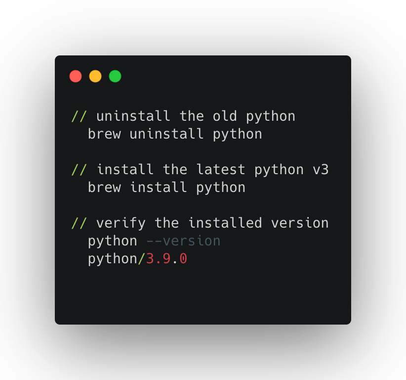
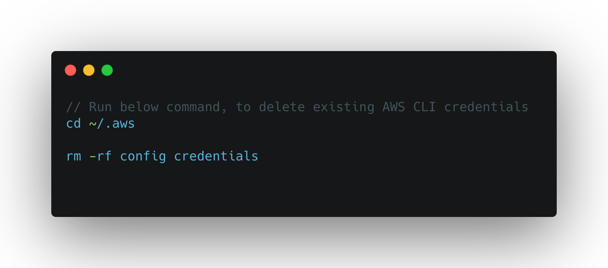
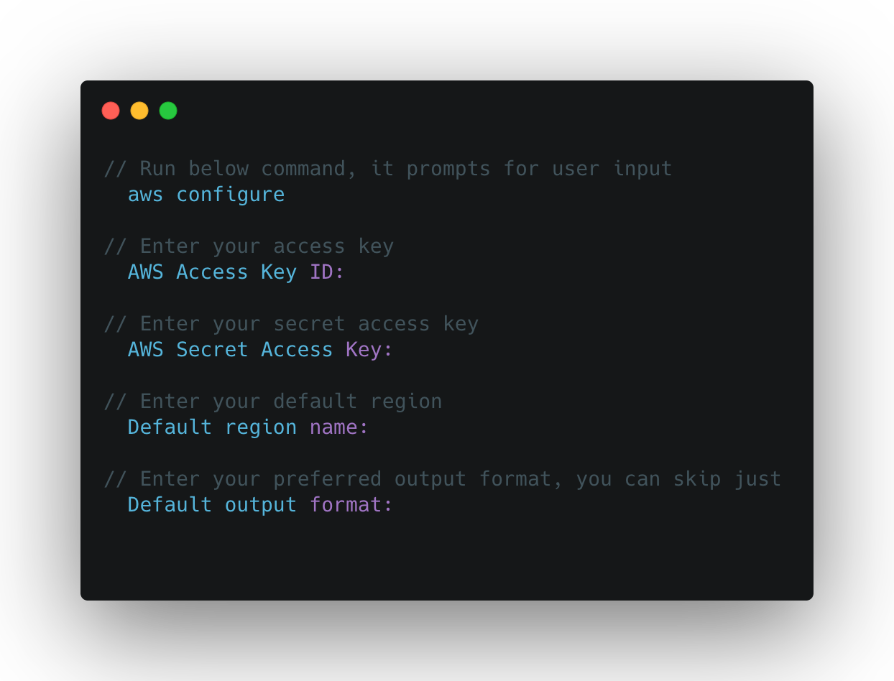
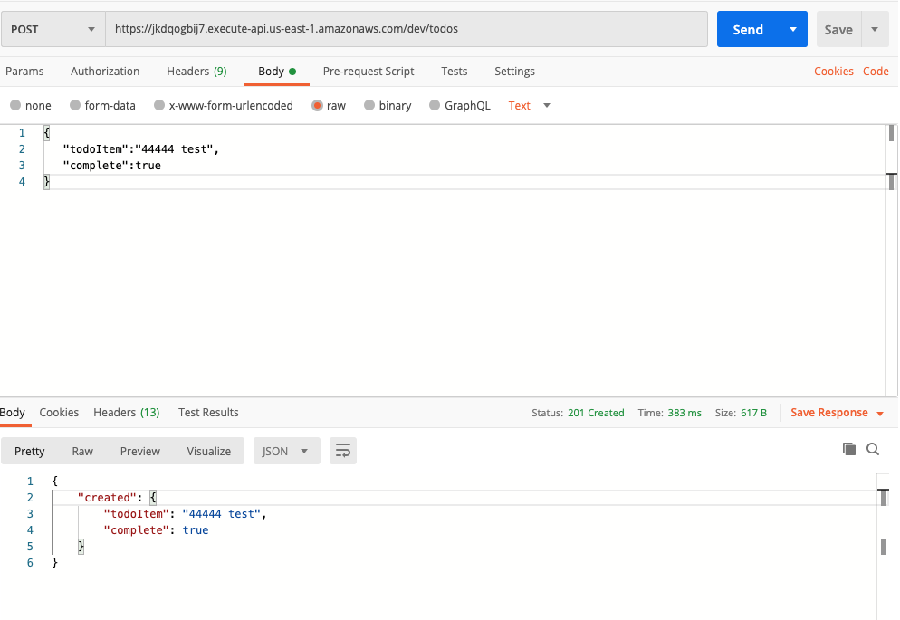
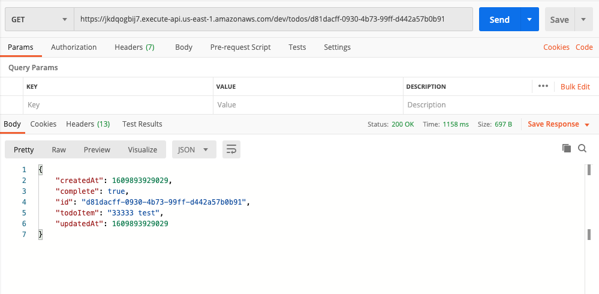
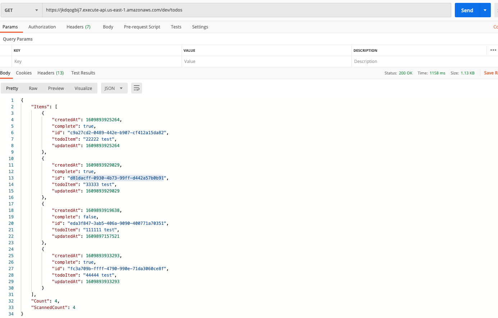
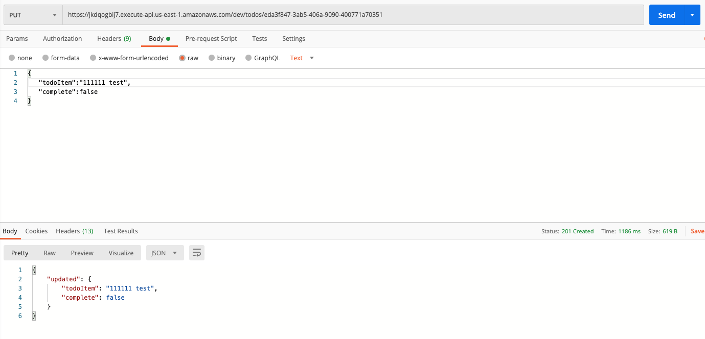
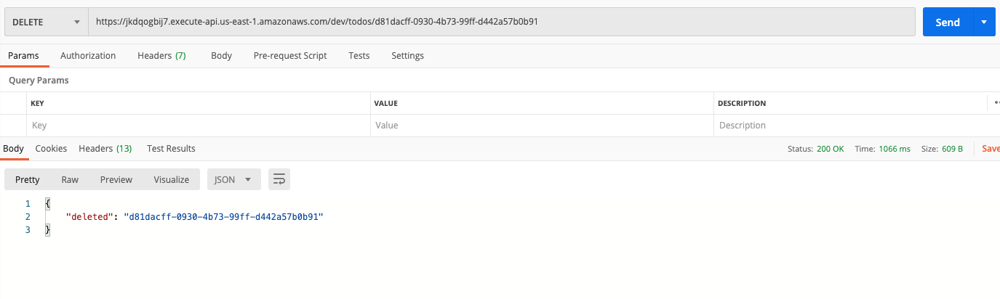

# aws-lambda-with-dynamodb

This project demonstrates how to make CRUD operations using AWS Lambda, AWS Dynamodb, AWS API Gateway via simple REST API with Node.js v12 and Typescript v4 using the Serverless Framework [Serverless Framework v2](https://www.serverless.com/). It includes the following files and folders.

- handler - Code for the application's Lambda function.
- serverless.ts - A typescript template that defines the application's AWS Lambda service, function, resources and trigger events
- package.json - Dev Dependencies and plugin `serverless-plugin-typescript`

**Table of contents:**

1. [Prerequisites and Installation](#prerequisites-and-installation)
2. [Dependencies and Libraries](#dependencies-and-libraries)
3. [Quick Start](#quick-start)
4. [Create AWS Lambda Function using Serverless Framework](#create-aws-lambda-function-using-serverless-framework)
5. [Serverless Environment Variables](#serverless-environment-variables)
6. [References](#references)
7. [Status and Issues](#status-and-issues)

## Prerequisites and Installation

1. Create a free-tier account in [AWS](www.aws.amazon.com).

2. Create an `IAM` user  with [AdministratorAccess](https://console.aws.amazon.com/iam/home?region=us-east-1#/policies/arn:aws:iam::aws:policy/AdministratorAccess$jsonEditor) policy and [AmazonS3FullAccess](https://console.aws.amazon.com/iam/home?region=us-east-1#/policies/arn:aws:iam::aws:policy/AmazonS3FullAccess$jsonEditor) policy. It is highly recommended not to use `Root` account.

3. Install Python v3.9.x

   

4. Install AWS CLI v2
   

5. Configure AWS CLI. To configure the AWS CLI you’ll need the following from your AWS account :

   1. Access Key Id
   2. Secret Key
   3. Default AWS region

6. To avoid conflict, delete the existing AWS CLI configurations and credentials
    

7. Configure AWS credentials for AWS CLI
    

8. Install Serverless Framework CLI

   ```bash
    npm install -g serverless
    ```

## Dependencies and Libraries

Library | Version | Notes
:-------|:--------:|-------
[Node](https://nodejs.org/) | 12.13.x | Recommended NodeJS version
[NPM](https://nodejs.org/) | 6.12.x | Recommended NPM version
[aws-lambda](https://github.com/awspilot/cli-lambda-deploy)  | 1.0.6 | Command line tool deploy code to AWS Lambda.
[aws-sdk](https://docs.aws.amazon.com/sdk-for-javascript/v2/developer-guide/dynamodb-examples.html)  | 2.821.0 | The AWS SDK for JavaScript enables developers to build libraries and applications that use AWS services.
[uuid](https://github.com/uuidjs/uuid)  | 8.3.2 | Generate RFC-compliant UUIDs in JavaScript
[Serverless Framework](https://www.serverless.com/) | 2.16.x | Framework for serverless development like Lambda, Azure functions, Google functions
[serverless-plugin-typescript](https://github.com/prisma-labs/serverless-plugin-typescript)| ~1.1.x | Serverless plugin for zero-config Typescript support
[serverless-offline](https://github.com/dherault/serverless-offline)| ~6.8.x | plugin emulates AWS λ and API Gateway on your local machine to speed up your development cycles. To do so, it starts an HTTP server that handles the request's lifecycle like APIG does and invokes your handlers
[Python](https://www.python.org/)| ~3.9.x | programming language
[awscli](https://aws.amazon.com/cli/)| ~2.x.x | AWS Command Line Interface

## Quick Start

1. Clone repository and run `npm install`

  ```bash
  git clone https://github.com/serverless-is/aws-lambda-with-dynamodb.git
  cd aws-lambda-with-dynamodb
  npm install
  ```

2. Create a `.env` file by renaming `.env-example` file and update the environmental values.

3. Test the lambda function by invoking the lambda function locally. runs your code locally by emulating the AWS Lambda environment.

  ```bash
   sls invoke local --function getToDoItem -p 1
  ```

4. Run `serverless offline` command to start the Lambda/API simulation.

  ```bash
  sls offline

  or

  sls offline start

  // Test the AWS lambda function locally via emulated API gateway.
  GET - http://localhost:3000/dev/todos/{id}

  or
  // start on specific port
   sls offline start --port 4000

   GET - http://localhost:4000/dev/todos/{id}
  ```

5. Deploy the service(defined in your current working directory) to AWS as lambda function and invoking event as REST End point via AWS API gateway.

  ```bash
 // deploy to default stage (dev) and default region (us-east-1). 
 sls deploy

 // deploy with stage and region options
 sls deploy --stage production --region us-west-1
  ```

6. Test the AWS lambda function.

  ```bash
  sls invoke -f createToDoItem
  sls invoke -f getToDoItem
  ```

7. Invoke `POST` REST API End Points to insert a item into `to-do-list` table using Postman

  ```bash
 POST - https://jkdqogbij7.execute-api.us-east-1.amazonaws.com/dev/todos

 Request Body :  {
   "todoItem":"44444 test",
   "complete":true
}
  ```



8. Invoke `GET` API End Points to retrieve an item from `to-do-list` table for a given `id`.

  ```bash
 GET - https://jkdqogbij7.execute-api.us-east-1.amazonaws.com/dev/todos/{id}
  ```



9. Invoke `GET` API End Points to retrieve all the items from `to-do-list` table.

  ```bash
 GET - https://jkdqogbij7.execute-api.us-east-1.amazonaws.com/dev/todos
  ```




10. Invoke `PUT` API End Points to update an item from `to-do-list` table for a given `id`.

  ```bash
 PUT - https://jkdqogbij7.execute-api.us-east-1.amazonaws.com/dev/todos/eda3f847-3ab5-406a-9090-400771a70351

 Request Body :  {
   "todoItem":"111111 test",
   "complete":false
}
  ```



11. Invoke `DELETE` API End Points to delete an item from `to-do-list` table for a given `id`.

  ```bash
 DELETE - https://jkdqogbij7.execute-api.us-east-1.amazonaws.com/dev/todos/d81dacff-0930-4b73-99ff-d442a57b0b91
  ```



12. If there are changes only to the functions(handler) and no changes to infrastructure(serverless.yml), then deploy only the function(no AWS cloudformation changes). This is a much faster way of deploying changes in code.

  ```bash
 sls deploy function -f createToDoItem

 // deploy with stage and region options
 sls deploy function -f createToDoItem --stage production --region us-west-1

 // deploy only configuration changes, ONLY Lambda-level configuration changes e.g. handler, timeout or memorySize
 sls deploy function -f createToDoItem --update-config
  ```

13. To list information about your deployments.

  ```bash
 // List existing deploys 
 sls deploy list

 // List deployed functions and their versions
 sls deploy list functions
  ```

14. To list information about the deployed service.

  ```bash
 sls deploy info
  ```

15. To watch the logs of a specific function.

  ```bash
  sls logs -f createToDoItem

  // Optionally tail the logs with -t
  sls logs -f createToDoItem -t

  // Optionally fetch only the logs that contain the string serverless
  sls logs -f createToDoItem --filter serverless
  ``` 

16. To remove the deployed service, defined in your current working directory

  ```bash
 sls remove

// Removal of service in specific stage and region
 sls remove --stage dev --region us-east-1
  ```

17. To Rollback a service to a specific deployment using timestamp

  ```bash
 sls rollback -t timestamp

// Optionally Shows any Stack Output
 sls rollback -v -t timestamp

// To get timestamp of all the existing deployments, run 
   sls deploy list 
  ```

## Create AWS Lambda Function using Serverless Framework

1. Create service a new service or project(aws-lambda-with-dynamodb) for AWS Lambda functions (createToDoItem, updateToDoItem, getToDoItem, getAllToDoItems and deleteToDoItem). You can define one or more functions in a service

  ```bash
  sls create --template aws-nodejs-typescript --path aws-lambda-with-dynamodb --name getToDoItem
  ```

  This creates 3 files:
    - gitignore file
    - handler.ts - Code for the application's Lambda function.
    - serverless.ts - A typescript template that defines the application's AWS Lambda service, function, resources and trigger events

1. Define events in `serverless.ts` to trigger the lambda function. On deploying this service, it create lambda function and REST API service via AWS API Gateway

  ```typescript
  functions: {
    createToDoItem: {
      handler: 'src/handler.createToDoItem',
      events: [
        {
          http: {
            method: 'post',
            path: 'todos',
            cors: true
          }
        }
      ]
    },
    updateToDoItem: {
      handler: 'src/handler.updateToDoItem',
      events: [
        {
          http: {
            method: 'put',
            path: 'todos/{id}',
          }
        }
      ]
    },
    getToDoItem: {
      handler: 'src/handler.getToDoItem',
      events: [
        {
          http: {
            method: 'get',
            path: 'todos/{id}',
          }
        }
      ]
    },
    getAllToDoItems: {
      handler: 'src/handler.getAllToDoItems',
      events: [
        {
          http: {
            method: 'get',
            path: 'todos',
          }
        }
      ]
    },
    deleteToDoItem: {
      handler: 'src/handler.deleteToDoItem',
      events: [
        {
          http: {
            method: 'delete',
            path: 'todos/{id}',
          }
        }
      ]
    }
  }
  ```

1. Define  plugins `serverless-plugin-typescript` and `serverless-offline` in `serverless.ts`

  ```typescript
  plugins: ['serverless-webpack', 'serverless-offline']
  ```

  Note: Add the plugins to your serverless.yml file and make sure that serverless-plugin-typescript precedes serverless-offline as the order is important:

  serverless-plugin-typescript: Serverless plugin for zero-config Typescript support.Works out of the box without the need to install any other compiler or plugins

  serverless-offline: This Serverless plugin emulates AWS Lambda and API Gateway on your local machine to speed up your development cycles. To do so, it starts an HTTP server that handles the request's lifecycle like API does and invokes your handlers.

1. On running the `sls deploy` command, will automatically compile the Typescript to JavaScript and creates an AWS Lambda function `aws-lambda-with-dynamodb-dev-getToDoItem` and a REST API via AWS API Gateway `dev-aws-lambda-with-dynamodb` with endpoints `https://85ja8seqp6.execute-api.us-east-1.amazonaws.com/dev/todos`

1. Run `serverless offline` command to start the Lambda/API simulation.

  ```bash
  sls offline

  or

  sls offline start

  // Test the AWS lambda function locally via emulated API gateway.
  GET - http://localhost:3000/dev/todos
  ```

## Serverless Environment Variables

Environmental variables can be provided to Lambda configuration file (serverless.ts or serverless.yml) and Lambda function using [serverless-dotenv-plugin](https://www.npmjs.com/package/serverless-dotenv-plugin).

Form More detail refer: [Documentation](https://www.serverless.com/plugins/serverless-dotenv-plugin), [Sample reference](https://www.serverless.com/framework/docs/providers/aws/guide/serverless.yml/), [Other](https://www.serverless.com/framework/docs/environment-variables/)  
## References

* [AWS SDK v2 for DynamoDB](https://docs.aws.amazon.com/sdk-for-javascript/v2/developer-guide/dynamodb-example-document-client.html).
* [AWS.DynamoDB.DocumentClient API v2](https://docs.aws.amazon.com/AWSJavaScriptSDK/latest/AWS/DynamoDB/DocumentClient.html)

## Status and Issues

* [Change History](./CHANGELOG.md).
* [Issue tracker](https://github.com/serverless-is/aws-lambda-with-dynamodb/issues?state=open)